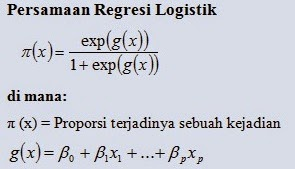

# Prediksi Penderita Penyakit Jantung Berdasarkan Statistik Kesehatan 

### Metode:
- Logistic Regression
- Random Forest

---

## Problem Domain

**Penyakit jantung menjadi penyebab utama kematian di berbagai negara salah satunya adalah Indonesia.**

Berdasarkan diagnosis yang dilakukan oleh dokter di Indonesia, prevalensi penyakit jantung di Indonesia memiliki angka yang cukup tinggi yaitu 1,5%. Riset Kesehatan Dasar 2018 mencatat bahwa penyakit jantung tersebar tanpa memandang usia. Umur 75 tahun ke atas dan 65 hingga 74 rahun menjadi umur yang memiliki angka tertinggi dengan prevalensi sebesar 4,7% dan 4,6%. Menurut (Jayani,2020) Badan Kesehatan Dunia (WHO) mencatat, 70% kematian di dunia pada 2015 disebabkan oleh penyakit tidak menular, dengan angka 45% dimiliki oleh penyakit jantung serta pembuluh darah.

**WHO atau yang sering disebut Data Organisasi Kesehatan Dunia menyebutkan bahwa di dunia terdapat 17 juta orang meninggal disebabkan oleh penyakit jantung dan pembuluh darah, Menurut (Firdaus, 2019)**.

Pada tahun 2018 berdasarkan data Riset Kesehatan Dasar, angka kejadian penyakit jantung dan pembuluh darah semakin meningkat pada tahun ke tahun, setidaknya, terdapat 15 dari 1000 orang, atau kurang lebih 2.784.064 masyarakat menderita penyakit jantung di Indonesia. Menurut Kemenkes kerugian ekonomi negara salah satunya diakibatkan oleh penyakit jantung dalam pembiayaan asuransi BPJS Kesehatan dibandingkan dengan penyakit lainnya. Dikutip dari (Kenshanahan, 2020), berdasarkan data BPJS Kesehatan, terdapat peningkatan dana untuk pembiayaan penyakit jantung. Dari pembiayaan sekitar Rp. 4,4 triliun pada tahun 2014 naik melejit menjadi Rp. 9,3 triliun pada tahun 2018 sehingga kemenkes melihat bahwa beban pembiayaan untuk penanganan penyakit 
jantung dapat dikendalikan dengan mengendalikan faktor risiko yang menyebabkan penyakit tersebut.

**Berdasarkan permasalahan diatas, maka penulis membuat sebuah sistem yang** 
**dapat memprediksi kemungkinan seseorang mengidap penyakit jantung dengan meneliti** 
**faktor-faktor yaitu antara lain jenis kelamin, usia, perokok, rokok dalam sehari, BMI dan lain-lain yang terdapat dalam dataset Framingham Heart Study dengan menggunakan** 
**metode algoritma Logistic Regression.** 

Maka dari itu, penulis mengangkat judul penelitian “Prediksi Penderita Penyakit Jantung Berdasarkan Statistik Kesehatan Menggunakan Metode Logistic Regression” guna membantu seseorang agar lebih waspada dalam menjaga kesehatannya yang nantinya akan berdampak pada berkurangnya angka kematian akibat penyakit jantung. Dengan demikian, prediksi akan terjadinya penyakit jantung sejak dini dengan menggunakan statistik kesehatan sangatlah diperlukan.

### Daftar Pustaka:
- Darna, N., & Herlina, E. (2018). Memilih Metode Penelitian yang Tepat: Bagi Penelitian Bidan Ilmu 
Manajemen.
- Dewi, S. (2016). Komparasi 5 Metode Algoritma Klasifikasi Data Mining pada Prediksi Keberhasilan 
- Pemasaran Produk Layanan Perbankan. Jurnal Techno Nusa Mandiri Vol. 60 XIII.
Fathiah, Rahmi, Z., & Nukman, H. (2014). Perbandingan Metodologi Klasik Dan Agile Dalam 
Pengembangan Sistem Informasi

---

## Business Understanding

### Problem Statement
- Bagaimana cara prediksi apakah seseorang beresiko menderita penyakit jantung atau tidak dalam 10 tahun kedepan dari statistik kesehatannya?
### Goals
- Memprediksi (klasifikasi) apakah seseorang beresiko menderita penyakit jantung atau tidak dalam 10 tahun kedepan dari statistik kesehatannya.
### Solution Statement
- **Solusi pertama** adalah menggunakan metode **Logistic Regression**, dimana metode ini merupakan metode yang efektif untuk melakukan klasifikasi yang outputnya hanya 0 dan 1 atau True/False.
- **Solusi kedua** adalah menggunakan metode **Random Forest**, dimana metode ini simpel untuk diimplementasikan, namun powerful. Maka dari itu, Random Forest digunakan sebagai pembanding dari Logistic Regression.
- **Dua Metrik utama** yang digunakan adalah:
	- **Akurasi** (Accuracy/score dari sklearn)
	- **Mean Squared Error** (MSE dari sklearn)
- Sebagai adisional, akan ditambahkan beberapa bantuan bagi pembaca untuk mempermudah dalam melihat hasil evaluasi metrik, yaitu:
	- Bobot & Bias tiap variabel pada model yang dipilih, yaitu logistic regression.
	
	- Confusion matrix dari masing-masing kuadran.
	
	- Heatmap dari Confusion Matrix.
	
	
---

## Data Understanding
Data yang digunakan adalah **Dataset statistik Heart Disease Prediction**.
Dataset dapat didownload [disini](https://www.kaggle.com/dileep070/heart-disease-prediction-using-logistic-regression).

- Overview Dataset (Pendekatan Statistik):
	- Dataset terdiri dari 4238 baris/record data, dan setiap record memiliki 16 kolom data. (Dimensi dari dataset adalah 4238 rows x 16 columns). Berikut adalah screenshot dari dataframe overview.
	
	  

	- Dataset memiliki beberapa nilai kosong atau NaN yang perlu dilakukan processing. Berikut adalah jumlah dari kolom NaN pada setiap kolom yang akan diproses dengan teknik yang akan dijelaskan dibawah.
	
	  
	
	- Berikut adalah relasi dari setiap data terhadap hasil prediksi dari Logistic Regression.

	    
	    
	    
	    
	    
	    
	    
	
- Fitur pada dataset (Pendekatan Linguistik):
    - Demografi singkat:
        - Sex: male or female
        - Age: Age of the patient
    - Perilaku responden:
        - Current Smoker: Perokok atau tidak.
        - Cigs Per Day: Sehari berapa batang rokok?
        - BP Meds: Apakah mengambil Blood Pressure Medication atau tidak.
        - Prevalent Stroke: Pernah stroke atau tidak.
        - Prevalent Hyp: Pernah hipertensi atau tidak.
        - Diabetes: Pernah diabetes atau tidak.
    - Statistika:
        - Tot Chol: total cholesterol level
        - Sys BP: systolic blood pressure
        - Dia BP: diastolic blood pressure
        - BMI: Body Mass Index
        - Heart Rate: heart rate
        - Glucose: glucose level (Continuous)
    - Variabel prediksi:
        - 10 year risk of coronary heart disease CHD (binary: “1” : Iya”, “0” : “Tidak”)

---

## Data Preparation
- Drop column yang kurang relevan. Hal ini akan membantu efektivitas dalam fitting model yang dilakukan.
- Mengisi missing value dengan median. Pengisian data dengan menggunakan median akan membantu "menetralkan" data yang hilang, karena pengisian median tidak akan menggeser atau menambah varians dari data.
- Scaling dengan Standard Scaler sklearn. Penggunaan Standard Scaler akan membuat fitur numerik dari data dapat diproses dengan lebih mudah oleh mesin untuk modelling.

---

## Modelling

Pembuatan model menggunakan 2 metode, yaitu:
- Logistic Regression
  Regresi logistik (kadang disebut model logistik atau model logit), dalam statistika digunakan untuk prediksi probabilitas kejadian suatu peristiwa dengan mencocokkan data pada fungsi logit kurva logistik. Metode ini merupakan model linier umum yang digunakan untuk regresi binomial.

	- Rumus dari logistic regression secara umum dapat dilihat pada gambar berikut:
	
	  
	
	  Dari gambar tersebut, kesimpulan yang dapat diambil adalah bobot dari tiap variabel akan dihitung dalam setiap iterasi untuk mencari nilai paling optimal dari bobot dan bias dari variabel penentu. Setiap proporsi akan dihitung untuk menjadi bobot dari model.

- Random Forest
  Metode Random Forest  merupakan salah satu metode dalam Decision Tree. Decision Tree atau pohon pengambil keputusan adalah sebuah diagram alir yang berbentuk seperti pohon yang memiliki sebuah root node yang digunakan untuk mengumpulkan data, Sebuah inner node yang berada pada root node yang berisi tentang pertanyaan tentang data dan  sebuah leaf node yang digunakan untuk memecahkan masalah serta membuat keputusan.
  
	- Rumus dari random forest secara umum dapat dilihat pada gambar berikut:
	
	  
	
	  Dari gambar tersebut, kesimpulan yang dapat diambil adalah setiap tree berdiri sendiri untuk mengambil keputusan dan memiliki keputusan yang independen. Dari setiap keputusan independen yang diambil oleh tree, keputusan akan diagregasi menjadi 1 keputusan akhir yang akan diimplementasikan oleh model dalam kasus klasifikasi atau regresi yang dilakukan.

Penggunaan Model
Berdasarkan testing yang akan dilakukan dalam proses-proses modelling berikut, maka dapat dilihat bahwa akurasi dari model Logistic Regression memiliki akurasi yang jauh lebih tinggi dibandingkan dengan Random Forest. Maka dari itu, model yang dipilih adalah Logistic Regression.

Langkah-langkah yang dilakukan:
1. Mendefinisikan model, dan metode yang digunakan, yaitu Logistic Regression & Random Forest.
2. Melakukan proses training (fitting) pada kedua model menggunakan dataset yang sama, yaitu dataset training. Keduanya menggunakan syntax yang sama, yaitu fit.
3. Melakukan testing pada test set berupa prediksi data pada dataset test, lalu menampilkan hasilnya berupa akurasi model untuk menentukan penggunaan model.
- Berdasarkan testing tersebut, maka dapat dilihat bahwa akurasi dari model Logistic Regression memiliki akurasi yang jauh lebih tinggi dibandingkan dengan Random Forest. Maka dari itu, model yang dipilih adalah Logistic Regression.

## Evaluasi
- Penggunaan Logistic Regression dalam data tersebut terbukti lebih baik berdasarkan metrik akurasi yang diberikan. Namun, terdapat anomali berupa MSE dari Logistic Regression lebih tinggi dibandingkan Random Forest.
Dari pemodelan ini, penulis akan memilih Logistic Regression sebagai model yang akan digunakan dalam prediksi CHD.

Metrik

- Dalam machine learning, istilah metrik mengacu pada suatu nilai yang dapat digunakan untuk merepresentasikan performa model yang dihasilkan.

  Pada pemodelan klasifikasi — output model berupa label/kelas — terdapat beberapa metrik yang umum digunakan. Oleh sebab itu, penting untuk memahami setiap metrik tersebut, sehingga kita dapat menggunakannya dengan tepat — sesuai dengan karakteristik masalah yang sedang kita modelkan. Hal ini terkait dengan 4 kuadran kebenaran yang ada, yaitu True Positive, True Negative, False Positive, dan False Negative. Berikut adalah visualiasi mengenai metrik evaluasi tersebut:

  

  Pengetahuan mengenai 4 kuadran tersebut akan membantu dalam proses mengenal confussion matrix yang akan disediakan untuk model Logistic Regression yang akan diberikan.

- Akurasi (Dalam akurasi, didapatkan bahwa Logistic Regression memiliki akurasi yang lebih tinggi bila dibandingkan dengan model Random Forest)

  - Akurasi merupakan metrik paling awam/paling diketahui pada pemodelan klasifikasi. Ia adalah persentase jumlah data yang diprediksi secara benar terhadap jumlah keseluruhan data. Berikut adalah rumus dalam melakukan pencarian terhadap akurasi sebuah model berdasarkan 4 kuadran tersebut:

    

  - Berikut adalah gambaran dari akurasi apabila digambarkan dalam teks berdasarkan model yang telah dibuat:

  

- MSE (Random Forest memiliki MSE yang lebih rendah, namun asumsi didasarkan pada akurasi yang rendah, maka MSE juga rendah)

	- Mean Squared Error (MSE) adalah Rata-rata Kesalahan kuadrat diantara nilai aktual dan nilai peramalan. Metode Mean Squared Error secara umum digunakan untuk mengecek estimasi berapa nilai kesalahan pada peramalan. Nilai Mean Squared Error yang rendah atau nilai mean squared error mendekati nol menunjukkan bahwa hasil peramalan sesuai dengan data aktual dan bisa dijadikan untuk perhitungan peramalan di periode mendatang. Metode Mean Squared Error biasanya digunakan untuk mengevaluasi metode pengukuran dengan model regressi atau model peramalan.
	
	  Berikut adalah gambaran dari akurasi apabila digambarkan dalam grafik berdasarkan model yang telah dibuat:
	
	  

Dari evaluasi ini, saya menambahkan beberapa metrik tambahan untuk memudahkan dalam melihat hasil akhir dari logistic regression berupa:
- Bobot & bias

  - Bobot merupakan salah satu faktor penting agar jaringan dapat melakukan generalisasi dengan baik terhadap data yang dilatihkan kedalamnya. Pemilihan inisialisasi bobot awal akan menentukan apakah jaringan mencapai global minimum atau hanya lokal minimum dan seberapa cepat konvergensi jaringannya. Sehingga, dengan mengetahui nilai bobot, dapat diketahui lebih dalam mengenai model yang telah dibuat.

  - Bias, hampir mirip dengan bobot, merupakan "penyeimbang" dari bobot yang ada, untuk mencapai nilai yang dianggap standar dan tidak berubah dalam setiap iterasinya.

  - Berikut adalah bobot dan bias dari masing-masing variabel yang ada pada model sebagai referensi. Urutan dari bobot sama dengan urutan pada proses pre-processing.

    

  

- Confusion Matrix Logistic Regression

  - Berdasarkan pengetahuan mengenai metrik yang telah didapatkan diatas, berikut adalah tampilan dalam bentuk teks yang merupakan TP, FP, TN, FN, yang ada pada model dalam bentuk teks, yang diekstrak menggunakan fungsi confusion matrix.

    

- Heatmap visualisasi Confusion Matrix

	- Untuk mempermudah dalam visualisasi dari CM, ini adalah tampilan dari heatmap dari hasil CM untuk mempermudah dalam melihat confusion matrix yang ada pada model Logistic Regression untuk mengetahui frekuensi terjadinya keempat kuadran tersebut.
	
    
